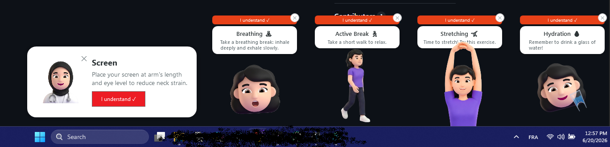
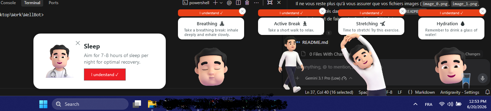
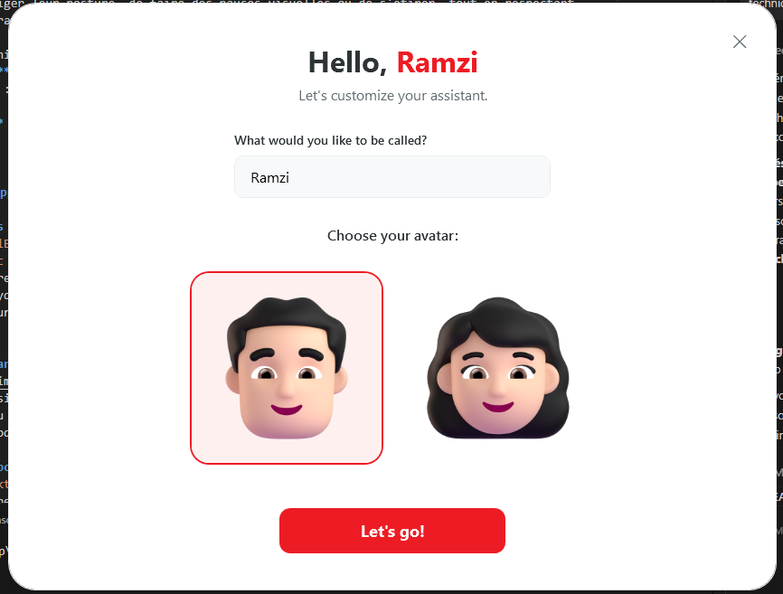
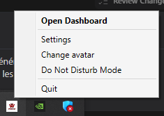
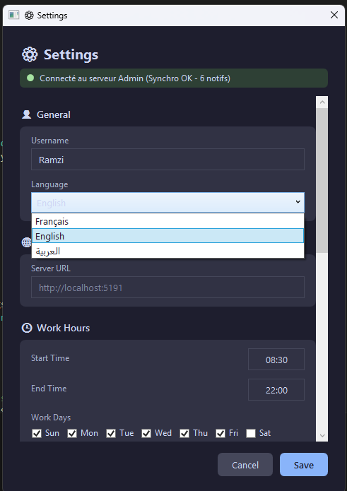
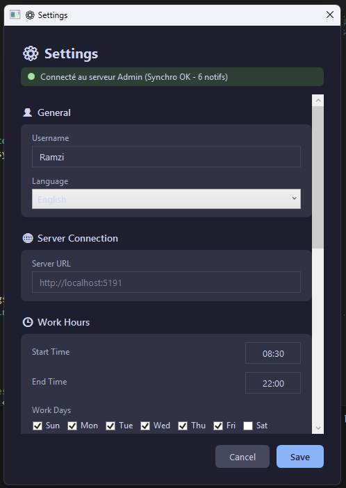
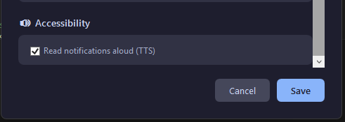
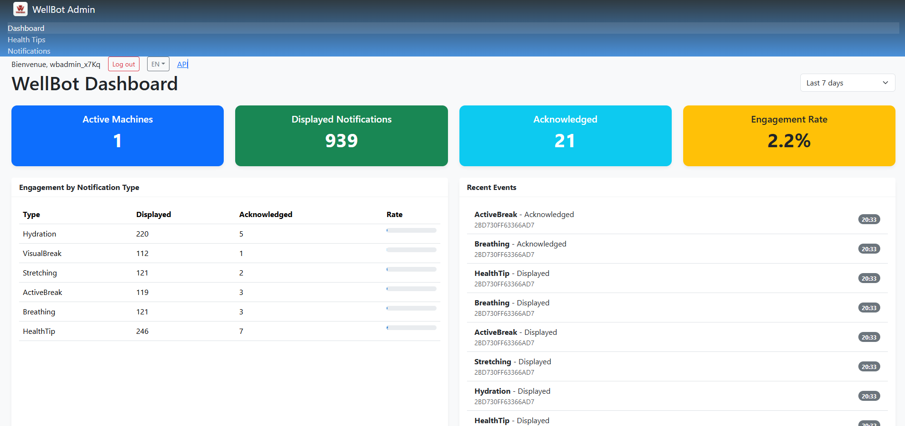

# WellBot - Workplace Wellbeing Assistant

## 🌟 Overview
**WellBot** is a corporate software solution designed to improve the health and wellbeing of employees working at screens. The application regularly reminds users to hydrate, correct their posture, take visual breaks, or stretch, all while strictly respecting their work schedules.

The solution is built around three main components:
- **WellBot.Desktop**: The Windows client application (WPF) that runs in the background.
- **WellBot.Admin**: The web administration portal (Blazor) to centralize management and statistics.
- **WellBot.Shared**: A shared contracts library (DTOs, Enums).

---

## 📸 Application Showcase (Screenshots)

### 1. Interactive and Animated Notifications


The desktop application displays non-intrusive popups in the bottom right corner of the screen. These notifications are thematic (Hydration, Posture, Stretching, Breathing, etc.) and feature animated 3D avatars. The user can acknowledge reading them via the "I understand" button, which helps measure engagement.

### 2. Onboarding and Avatar Selection

Upon first launch, a personalized onboarding screen allows the user to set their preferred name and choose a 3D avatar that will accompany them in the daily notifications.

### 3. Taskbar Menu (Systray)

WellBot operates silently in the Windows system tray. A simple right-click provides access to the dashboard, settings, avatar customization, or allows temporarily enabling "Do Not Disturb" mode.

### 4. Customizable Local Settings
Each user can configure their preferences directly from the application across multiple tabs:
- **General & Work Hours**: 
  
  Personalize the username, interface language, server connection link, and define work hours (e.g., 08:30 - 17:00) and work days. Notifications are intelligently disabled outside these hours to ensure the right to disconnect.
- **Schedules & Animations**: 
  
  Allows users to override server settings for notification intervals and customize avatar animation scales and delays.
- **Accessibility**: 
  
  Option to read health tips aloud using Text-to-Speech (TTS) for better accessibility.

### 5. Administration Console (Dashboard)

A comprehensive web supervision portal intended for administrators or HR departments offering:
- Real-time statistics (Active machines, volume of displayed vs. acknowledged notifications, overall engagement rate).
- Detailed engagement tracking by category (Hydration, VisualBreak, etc.).
- A real-time feed of recent analytical events.
- A multilingual interface (French, English, Arabic) with configurable time filters.

---

## 🛠️ Technical Architecture

### Back-End & Web Portal (`WellBot.Admin`)
- **Technology**: ASP.NET Core 8 with Blazor Server.
- **Database**: SQLite (`wellbot.db`) via Entity Framework Core 8.
- **Security**: 
  - Cookie-based authentication for the web interface.
  - Basic Authentication to secure API endpoints.
  - Role-based policy segregation (`AdminOnly` vs `DesktopClient`).
- **Key Features**:
  - **Minimal REST APIs**: Ultra-fast endpoints to collect client telemetry and distribute "Health Tips".
  - **Telemetry & Polling**: Asynchronous dashboard with a timer (`PeriodicTimer`) to display analytics in real-time while securing database access via `SemaphoreSlim`.
  - **Data Retention**: Automatic purging of old analytical events (e.g., > 7 days) using high-performance `ExecuteDeleteAsync()`.
  - **Internationalization (i18n)**: Implemented via `RequestLocalizationOptions` and a custom dynamic translation service (`SimpleLocalizer`).

### Desktop Application (`WellBot.Desktop`)
- **Technology**: WPF (Windows Presentation Foundation) running on .NET 8.
- **Architecture**: MVVM (Model-View-ViewModel) pattern powered by `CommunityToolkit.Mvvm`.
- **Key Features**:
  - **Smart Scheduler (`NotificationScheduler`)**: Calculates intervals, manages a notification queue, and detects Windows session locks to avoid missing alerts.
  - **Resource Management**: Uses "Pack" URIs to correctly load assets (images, sounds) after deployment.
  - **Text-to-Speech (TTS)**: Audio playback of health tips for improved accessibility.
  - **Native Systray**: Seamless OS integration using the `Hardcodet.NotifyIcon.Wpf` library.
  - **Local Security**: Protection of sensitive data and credentials saved locally via DPAPI (`System.Security.Cryptography.ProtectedData`).

### Shared Library (`WellBot.Shared`)
- A common class library defining communication contracts (`AnalyticsEventDto`, `NotificationConfigDto`) and enumerations (`NotificationType`, `AnalyticsAction`). This guarantees data consistency between the WPF client and the ASP.NET API.

---

## ⚙️ Advanced Functional Logic
1. **Analytics and Engagement Rate**: Each displayed popup triggers an asynchronous `Displayed` event. If the employee interacts by clicking "I understand", a second `Acknowledged` event is logged. The server cross-references these two metrics to calculate the success KPI of the wellbeing campaign.
2. **Centralized Synchronization**: If an administrator modifies the reminder frequency for hydration via the portal, the Desktop application automatically fetches this update from the API and adjusts its internal scheduler accordingly.
3. **Resilience and Local Storage**: The Desktop application retains its configuration in memory even during brief connection losses with the admin server, ensuring continuity in wellbeing tracking.

---

## 🚀 Getting Started & Execution

### 1. Running the Admin Console (Docker - Recommended)
The easiest way to run the `WellBot.Admin` backend is using Docker and Docker Compose. This ensures a clean, isolated environment.

1. Ensure you have [Docker Desktop](https://www.docker.com/products/docker-desktop) installed.
2. Open a terminal at the root of the project (where `docker-compose.yml` is located).
3. Build and start the service in detached mode:
   ```bash
   docker-compose up -d --build
   ```
4. The Admin portal and API will be accessible at `http://localhost:5191` (or the port defined in your `docker-compose.yml`).

*Alternatively, to run it locally via .NET CLI:*
```bash
cd src/WellBot.Admin
dotnet run
```

### 2. Running the Desktop Client
The `WellBot.Desktop` application is a WPF Windows client. It requires a Windows environment.

1. Open the solution in Visual Studio or use the .NET CLI.
2. Run the application:
   ```bash
   cd src/WellBot.Desktop
   dotnet run
   ```
3. Upon first launch, the Onboarding screen will appear. Configure your name, avatar, and ensure the Server URL in the Settings matches your Admin Console address (e.g., `http://localhost:5191`).
